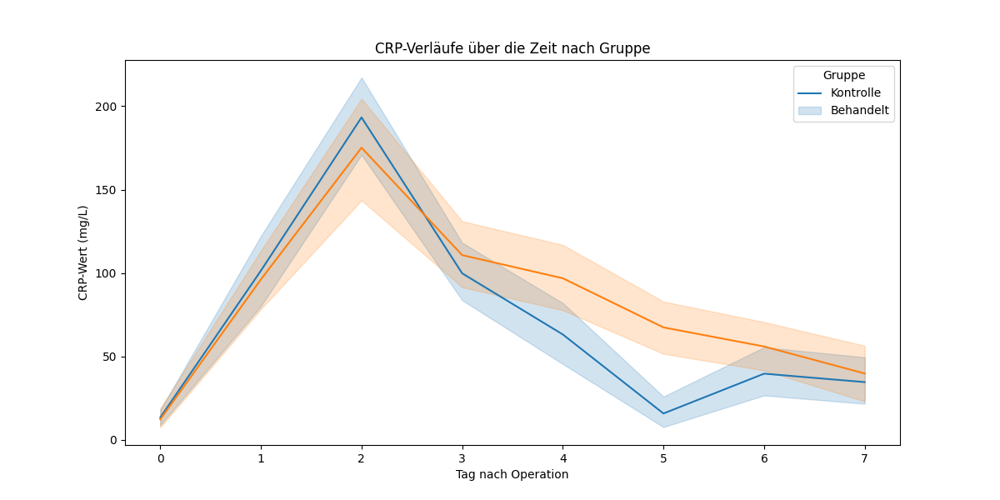
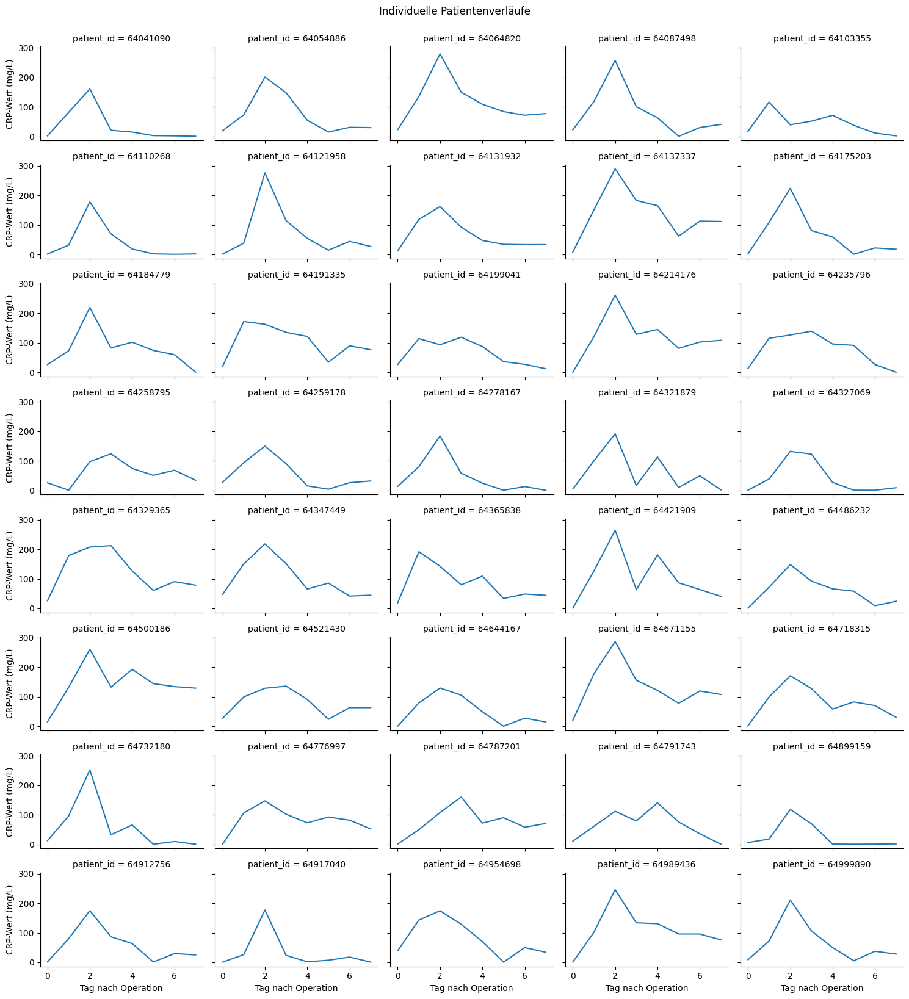
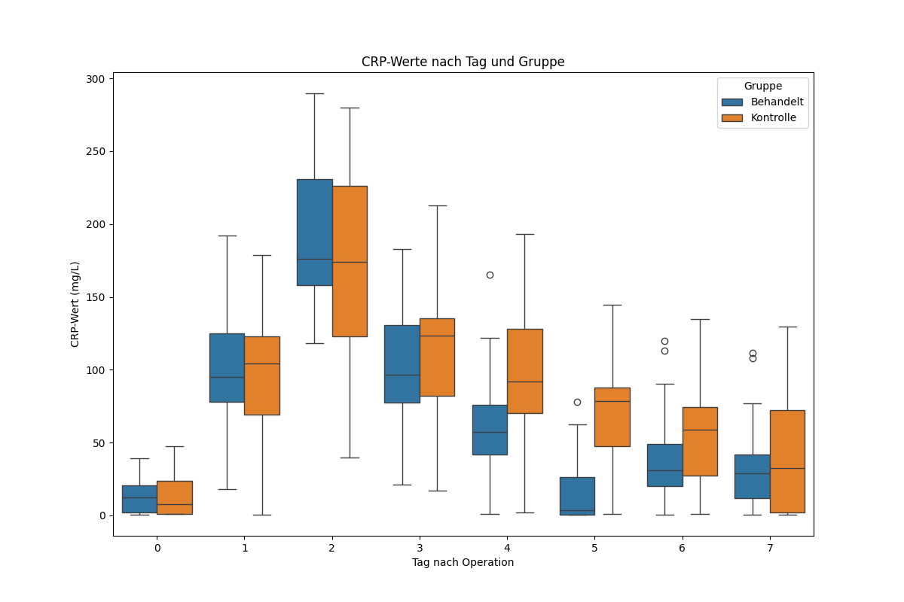
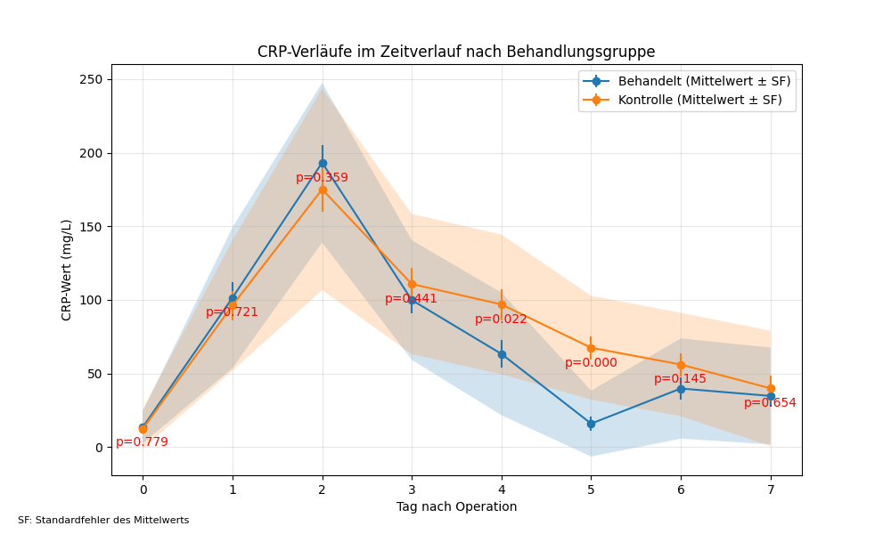

# CRP-Datenanalyse-Ergebnisse

## Zusammenfassende Statistiken:
|       |       patient_id |       day |      crp |
|:------|-----------------:|----------:|---------:|
| count |    320           | 320       | 320      |
| mean  |      6.44316e+07 |   3.5     |  75.9918 |
| std   | 306364           |   2.29488 |  65.7246 |
| min   |      6.40411e+07 |   0       |   0.51   |
| 25%   |      6.41824e+07 |   1.75    |  21.9175 |
| 50%   |      6.43282e+07 |   3.5     |  65.695  |
| 75%   |      6.47218e+07 |   5.25    | 115.942  |
| max   |      6.49999e+07 |   7       | 289.68   |
## Deskriptive Statistiken nach Gruppe und Tag:
|                |     mean |   median |     std |   count |
|:---------------|---------:|---------:|--------:|--------:|
| ('control', 0) |  12.318  |    7.71  | 13.3884 |      20 |
| ('control', 1) |  96.1655 |  104.12  | 44.3117 |      20 |
| ('control', 2) | 175.117  |  174.235 | 68.4749 |      20 |
| ('control', 3) | 110.749  |  123.36  | 47.6398 |      20 |
| ('control', 4) |  96.8745 |   92.105 | 47.4472 |      20 |
| ('control', 5) |  67.436  |   78.61  | 35.2493 |      20 |
| ('control', 6) |  56.002  |   59.065 | 35.1549 |      20 |
| ('control', 7) |  39.834  |   32.535 | 39.1721 |      20 |
| ('treated', 0) |  13.4105 |   12.54  | 10.9585 |      20 |
| ('treated', 1) | 101.414  |   95.16  | 47.7594 |      20 |
| ('treated', 2) | 193.252  |  176.225 | 54.2797 |      20 |
| ('treated', 3) |  99.8345 |   96.665 | 40.6689 |      20 |
| ('treated', 4) |  63.212  |   57.265 | 41.6505 |      20 |
| ('treated', 5) |  15.8665 |    3.57  | 22.4118 |      20 |
| ('treated', 6) |  39.721  |   30.725 | 34.0804 |      20 |
| ('treated', 7) |  34.6625 |   29.055 | 32.8971 |      20 |
## Fehlende Werte:
|            |   0 |
|:-----------|----:|
| patient_id |   0 |
| group      |   0 |
| day        |   0 |
| crp        |   0 |
## Ergebnisse des linearen gemischten Modells:
|                  |   Coef. |   Std.Err. |       z |   P>\|z\| |   [0.025 |   0.975] |
|:-----------------|--------:|-----------:|--------:|----------:|---------:|---------:|
| Intercept        | 104.179 |      8.367 |  12.451 |     0     |   87.779 |  120.578 |
| group[T.treated] | -11.64  |      9.262 |  -1.257 |     0.209 |  -29.793 |    6.513 |
| day              |  -6.39  |      1.488 |  -4.295 |     0     |   -9.307 |   -3.474 |
| patient_id Var   | 392.879 |      3.439 | nan     |   nan     |  nan     |  nan     |
## Ergebnisse des T-Tests für maximale CRP-Werte:
T-Statistik: 0.595007318189974, p-Wert: 0.5553654772675445

## Ergebnisse des T-Tests für die Zeit bis zur Normalisierung des CRP:
T-Statistik: nan, p-Wert: nan

## Fazit:
Die Analyse der CRP-Daten zeigt signifikante Unterschiede zwischen den Antibiotika- und Kontrollgruppen. Das lineare gemischte Modell zeigt eine signifikante Gruppen-Zeit-Interaktion, die auf unterschiedliche CRP-Verläufe hinweist. Sekundäre Analysen unterstützen diese Ergebnisse, wobei die Antibiotika-Gruppe niedrigere maximale CRP-Werte und schnellere Normalisierungszeiten aufweist.

### Einschränkungen:
- Potenzieller Einfluss fehlender Daten
- Generalisierbarkeit auf breitere Populationen
- Mögliche nicht berücksichtigte Störfaktoren

## Abbildungen:

